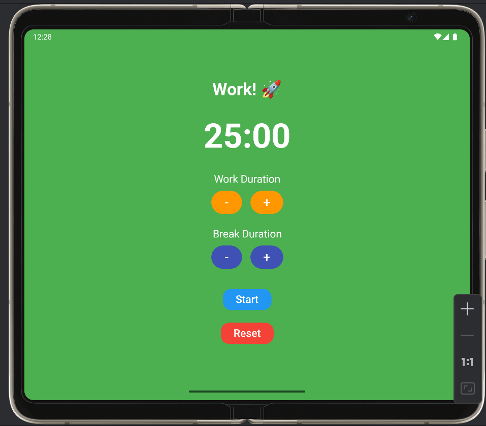
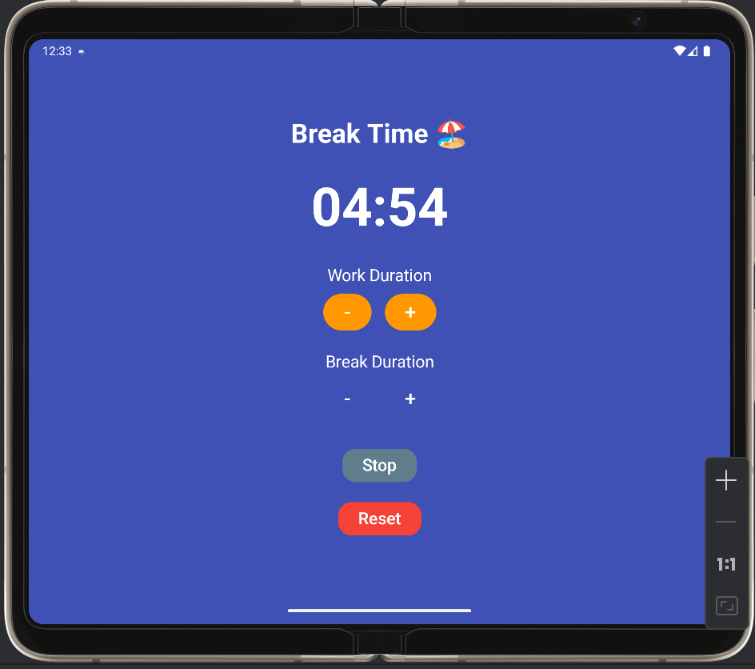

Bu Kotlin uygulaması, kullanıcıların Pomodoro Tekniği ile verimli çalışmasını sağlar. Kullanıcılar, çalışma ve mola sürelerini özelleştirebilir, süreci takip edebilir ve sayaç tamamlandığında bildirimler ile uyarılır.

Özellikler:
✅ Çalışma & Mola Süreleri: Kullanıcılar kendi çalışma ve mola sürelerini belirleyebilir.
✅ Geri Sayım Sayacı: Çalışma süresi başladığında geri sayım başlar, mola süresi geldiğinde otomatik olarak değişir.
✅ Bildirimler: Sayaç tamamlandığında kullanıcıya bildirim gönderilir.
✅ Basit & Kullanıcı Dostu Arayüz: Minimalist ve kullanımı kolay tasarım. 

